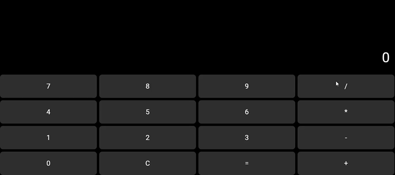

# Aplicação de Calculadora em Flutter utilizando Componentização

Aplicativo de calculadora simples desenvolvido em Flutter com foco na aplicação de conceitos de desenvolvimento de interfaces e componentização de widgets.

O sistema possui uma interface gráfica funcional que permite a realização de operações matemáticas básicas.

## Estrutura do projeto
```
calculadora/                                           
├── lib/                                               
│   ├── main.dart                    # Ponto de entrada da aplicação     
│   ├── controllers/                        
│   │   └── calculator_logic.dart    # Lógica da calculadora
│   ├── screens/                                 
│   │   └── calculator_screen.dart   # Tela principal
│   └── widgets/                      
│       ├── calc_button.dart         # Widget de botão                         
│       └── calc_display.dart        # Widget de display 
├── pubspec.yaml
└── README.md
```

## Funcionalidades

- Inserção de números
- Operações matemáticas:
    - Adição (+)
    - Subtração (-)
    - Multiplicação (*)
    - Divisão (/)
- Exibição da conta na tela
- Exibição do resultado
- Limpeza da operação (C)

## Componentização

O projeto utiliza separação da interface em widgets reutilizáveis:

```CalcButton```                    
Responsável pelos botões numéricos e de operação
Reutilizável para todos os botões da calculadora

```CalcDisplay```                         
Responsável pela exibição da expressão e resultado
Atualizado dinamicamente conforme as ações do usuário

```CalculatorLogic```                    
Contém toda a lógica da aplicação
Responsável pelos cálculos e controle de estado

```CalculatorScreen```
Integra os componentes
Gerencia eventos e renderização da interface

## Layout Utilizado

O layout da aplicação foi construído utilizando:

```Column``` → organização vertical                            
```Row``` → organização dos botões                         
```Expanded``` → distribuição proporcional dos elementos              
```Container``` → estilização dos componentes

## Conceitos Aplicados
- Programação Orientada a Objetos (POO)
- Componentização de widgets
- Reutilização de código
- Gerenciamento de estado com setState

## Instruções para Execução
Pré-requisitos

Ter o Flutter instalado, verifique em:

> flutter --version     

### Executar o projeto

> cd calculadora_flutter         
flutter pub get                       
flutter run -d web-server

Após executar, abra o link gerado pelo terminal no navegador

## Interface



