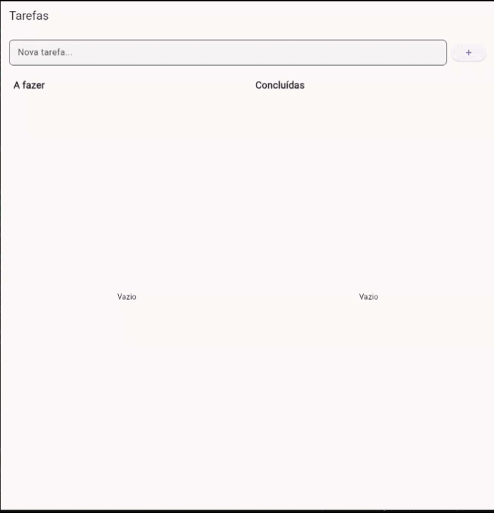
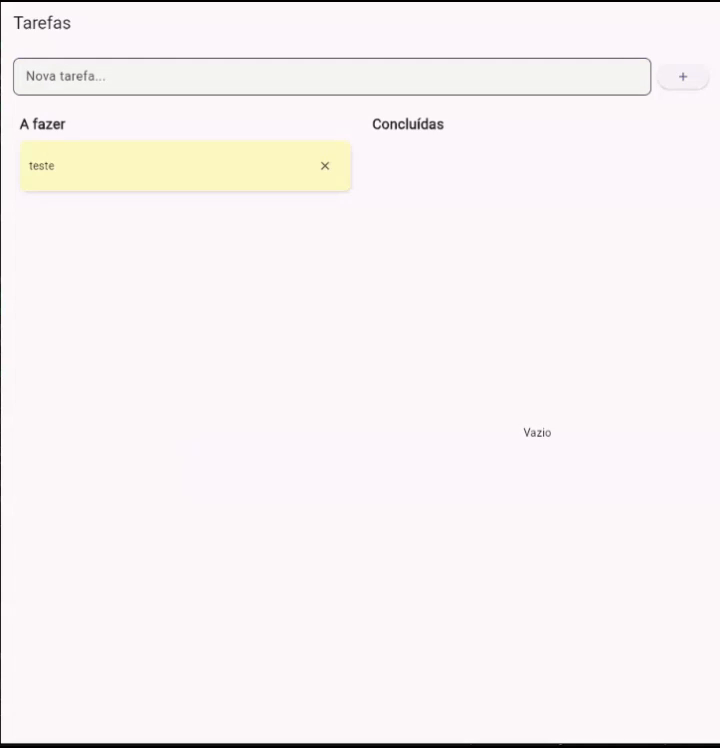
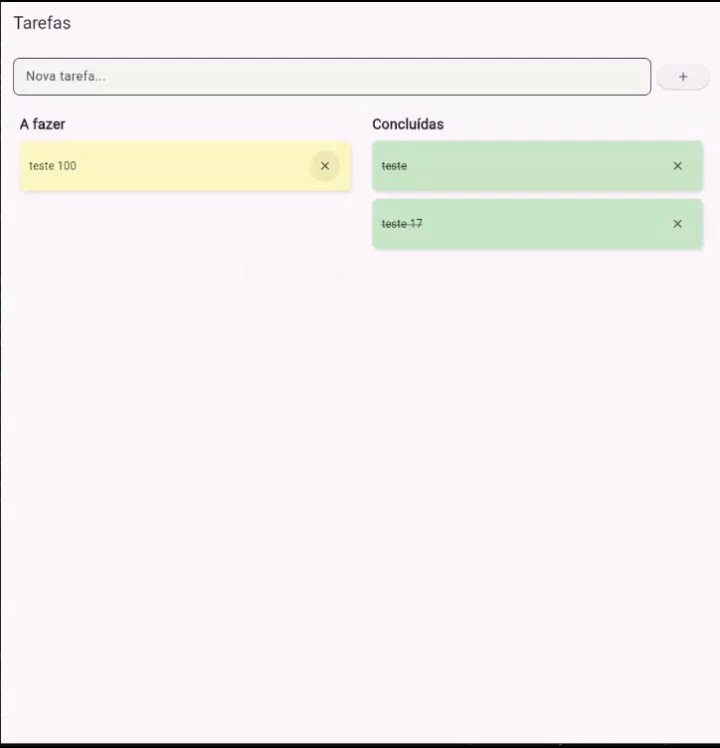

# To-Do List com Flutter e Riverpod

## Descrição

Aplicação simples de lista de tarefas desenvolvida em Flutter.  
Permite ao usuário adicionar, visualizar, marcar como concluídas e remover tarefas.

As tarefas são organizadas em duas colunas:
- A fazer
- Concluídas

O status da tarefa é definido pela coluna em que ela se encontra,
funcionando de forma similar a um kanban.

A movimentação é implementada com os widgets nativos do Flutter:
- `LongPressDraggable` — envolve cada card de tarefa, tornando-o arrastável
  após pressão longa
- `DragTarget` — envolve cada coluna, aceitando cards soltos sobre ela
  e disparando `setCompleted` com o novo status correspondente

---

## Gestão de Estado

A gestão de estado foi implementada utilizando Riverpod com `StateNotifier`.

- O estado é uma lista de tarefas (`List<Task>`)
- A classe `TaskNotifier` é responsável por gerenciar alterações
- O estado é imutável: sempre que há mudança, uma nova lista é criada.
Isso é necessário porque o Riverpod compara referências, então se a lista
for modificada diretamente, ele não detecta a mudança e os widgets
não reconstroem.

Principais métodos:

- `addTask` → adiciona uma nova tarefa
- `removeTask` → remove uma tarefa
- `setCompleted(id, bool)` → usado pelo drag and drop, define o status
  diretamente conforme a coluna de destino
- `toggleTask(id)` → alterna o status sem precisar saber o valor atual,
  usado por checkbox ou toque direto no card

Os widgets utilizam:
- `ref.watch` para escutar mudanças no estado
- `ref.read` para executar ações

---

## Gifs de Funcionamento

1. Criando Tarefas

2. Arrastando Tarefas

3. Removendo Tarefas

## Dependências
- flutter_riverpod: ^2.6.1

## Execução

1. Clonar o repositório:
   git clone https://github.com/gustabayer/atividades-dart
2. Entrar no diretório:
   cd atividades-dart/ATIVIDADE4
3. Instalar dependências:
   flutter pub get
4. Executar:
   flutter run